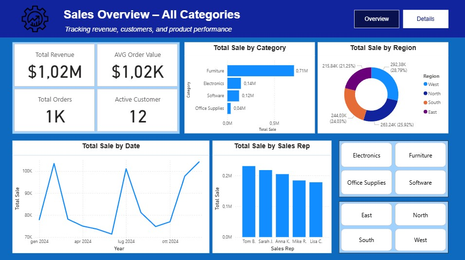
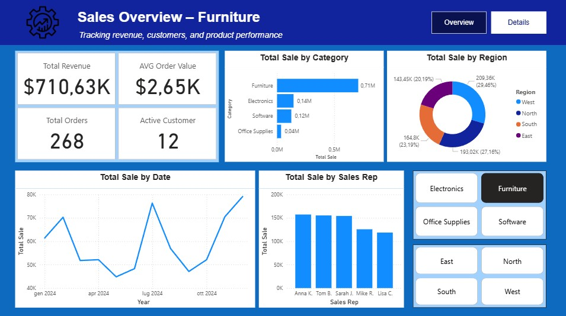
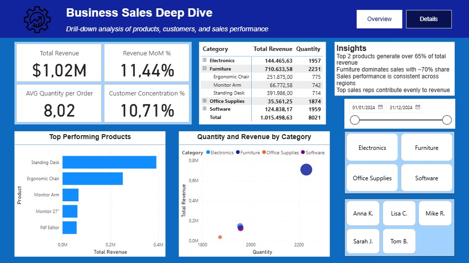

# Sales Performance Analysis – Business Sales Dataset (2024)
End-to-end data analysis project using Python, R, and Power BI to clean, structure, and analyze sales data, providing actionable insights on revenue, customers, and product performance.

---

## Business Context

This project analyzes transactional sales data from a small-to-medium business operating across multiple regions and product categories.

The objective is to **transform raw, messy data** into a **structured dataset** and build an **interactive dashboard** to support sales monitoring, performance evaluation, and decision-making.

---

## Dataset Overview

- **Time period:** January - December 2024
- **Granularity:** order-level data
- **Observations:** 1,000 sales records

The dataset includes information on customers, products, categories, sales representatives, pricing, and geographic regions.

---

## Data Source

The dataset used in this project is a synthetic dataset designed to simulate real-world business sales data.

It was intentionally created with inconsistencies and missing values to replicate common data quality issues found in real business environments.

The raw dataset is included in this repository in the `data/` folder.

---

## Objectives & Key KPIs

The analysis focuses on the following KPIs:

- **Total Revenue**
- **Total Orders**
- **Active Customers**
- **Average Order Value (AOV)**
- **Revenue Growth (MoM %)**
- **Customer Concentration (%)**

Additional analyses include:

- Sales trends over time
- Top-performing products and categories
- Sales distribution by region
- Sales representative performance
- Top N product analysis
- Quantity vs Revenue analysis

---

## Methodology

**Python** & **R** were used for data cleaning, preprocessing, and transformation:
- handling missing values
- data standardization
- dataset restructuring

**Power BI** was used to build an interactive dashboard:
- KPI calculation using DAX
- dynamic filtering and drill-down analysis
- business-oriented data visualization

The workflow reflects a real-world pipeline from raw data → cleaned dataset → business insights.

---

## Project Structure
  - data/ # Raw dataset and Python script to generate it
  - scripts/ # Data cleaning scripts (Python / R) and resulting cleaned data
  - powerbi/ # Power BI dashboard (.pbix)
  - images/ # Dashboard screenshots
  - README.md
---

## How to Use

1. Open the `data/` folder to visualise the raw dataset.
2. Run the scripts in the `scripts/` folder to reproduce the data cleaning process.
3. Explore the cleaned dataset.
4. Open the Power BI file in the `powerbi/` folder to interact with the dashboard.
5. Use filters (category, region, sales rep) to explore different business scenarios.
6. Refer to the screenshots in the `images/` folder for a static overview.

---

## Dashboard Preview

**Overview** – headline sales KPIs and long-term trends, also by category, region and representatives 
**Overview - Category Breakdown** – overview selecting a certain category 
**Deep Dive** – detailed analysis by category and product 

---

## Key Insights

- Revenue is highly concentrated in a small number of products, with top performers driving the majority of sales.
- Furniture represents the dominant category, contributing the largest share of total revenue.
- Sales performance is relatively consistent across regions, with no major geographic outliers.
- Sales representatives show balanced performance, indicating a well-distributed sales structure.
- Clear opportunities exist to diversify revenue and reduce dependency on top products.

---

## Tools & Skills
- **Python / R**: data cleaning, preprocessing, automation
- **Power BI**: dashboard design, DAX measures, data visualization
- **Data Analysis**: KPI definition, trend analysis, business insights
- **Data Preparation**: handling messy data, structuring datasets for analysis